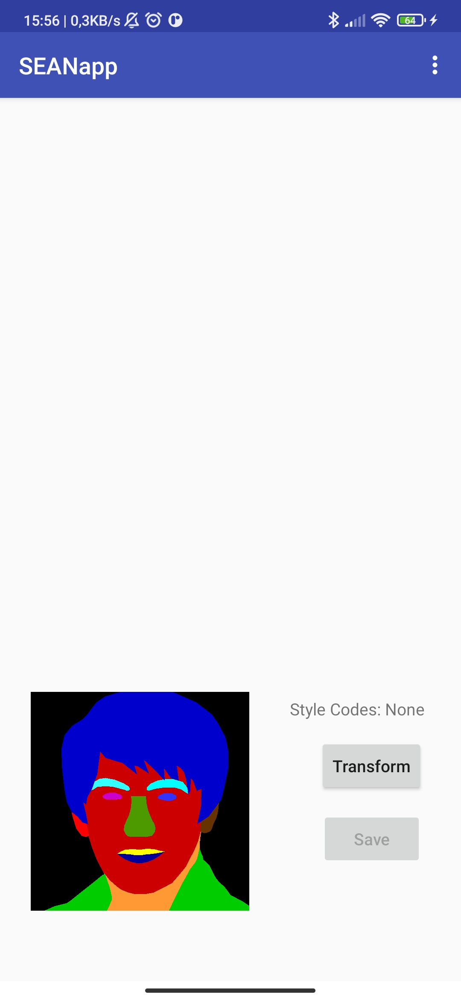
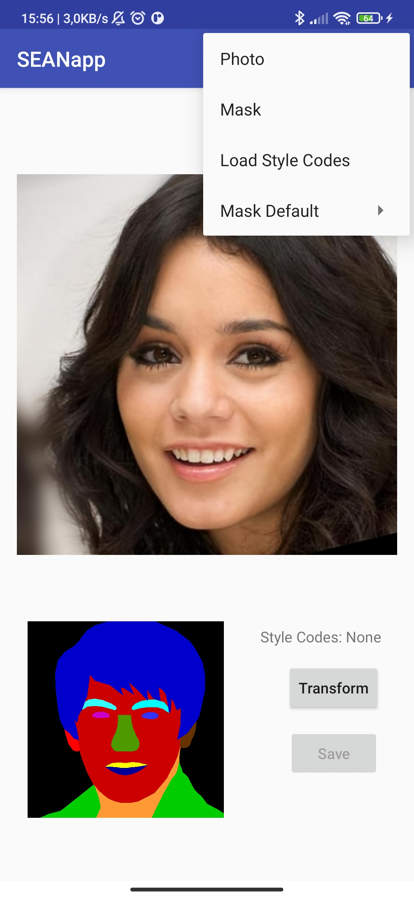

# SEANapp

## Dataset

Si utilizza il dataset [CelebA-HQ](https://github.com/tkarras/progressive_growing_of_gans) e [CelebAMask-HQ](https://github.com/switchablenorms/CelebAMask-HQ).
Si può scaricare da [qui](https://drive.google.com/file/d/1TKhN9kDvJEcpbIarwsd1_fsTR2vGx6LC/view?usp=sharing). 

## Preparazione

Per poter creare il modello da utilizzare nell'applicazione bisogna scaricare i modelli *pre-trained* da [Google Drive Folder](https://drive.google.com/file/d/1UMgKGdVqlulfgOBV4Z0ajEwPdgt3_EDK/view?usp=sharing) inserirli nella cartella `./checkpoints`.

Sul dispositivo mobile su cui verrà installata l'applicazione sarà necessario scaricare una versione ridotta del dataset nella cartella Download del dispositivo da [One Drive Folder](https://univpr-my.sharepoint.com/:u:/g/personal/teresa_calzetti_studenti_unipr_it/Ed9UstpDczhBqk1io-Tu2eEB_dbZpnlvfufSzhuoCm5qbA?e=C8Qt7y): 
in questo modo le immagini da modificare si troveranno nella cartella `./Downloads/SEAN/images/`
## Creazione modello

Per la creazione del modello basterà eseguire il comando 

```bash
python ./modelSEAN.py
```

A questo punto sarà creato il file *sean.ptl* tra gli assets dell'applicazione.

## Funzionamento



Una volta avviata l'applicazione verrà mostrata una schermata con una maschera di default (modificabile selezionando la voce *Mask Default* nel menu in alto, oppure selezionando una nuova maschera tra quelle presenti nella cartella `./Downloads/SEAN/`, mediante la voce *Mask* nel menu in alto).
Selezionando un'altra maschera verrà mostrata nella schermata in basso a sinistra.

L'immagine che si vuole modificare dovrà essere selezionata mediante la voce nel menu in alto *Photo* tra le immagini presenti nella cartella `./Downloads/SEAN/images` e verrà mostrata al centro della schermata.


Per effettuare la modifica basterà premere sul pulsante *Transform*.
Il pulsante *Save* permetterà di salvare l'immagine generata nella cartella `./Downloads/` del dispositivo.